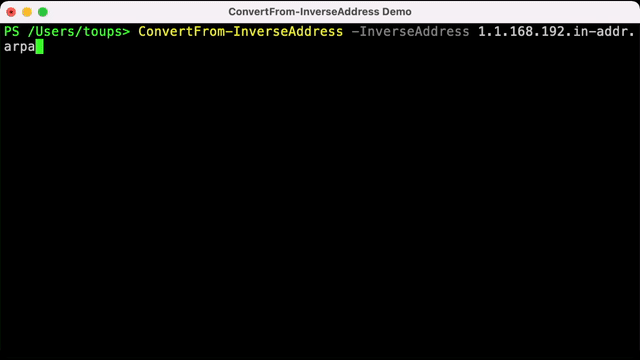
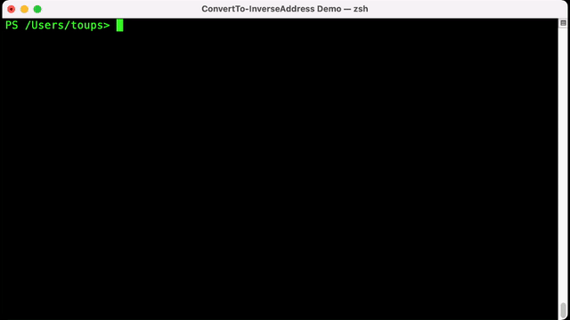
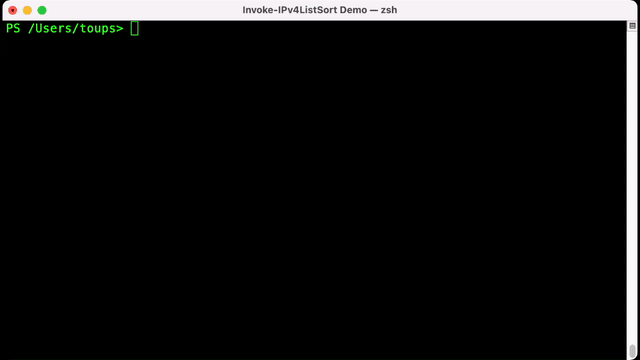
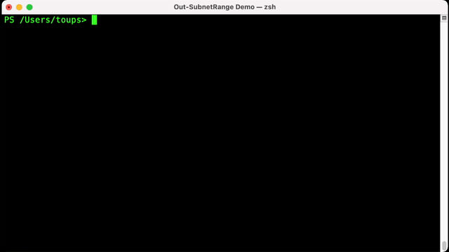
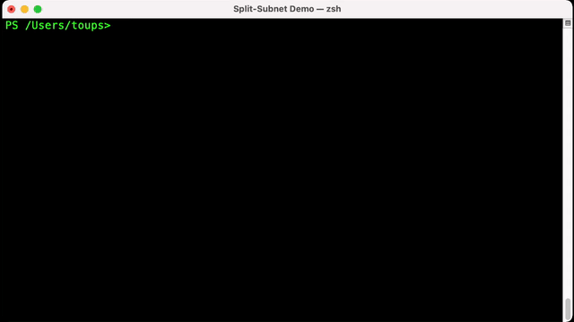
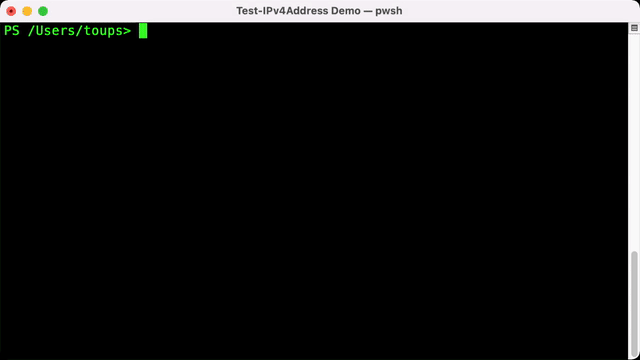
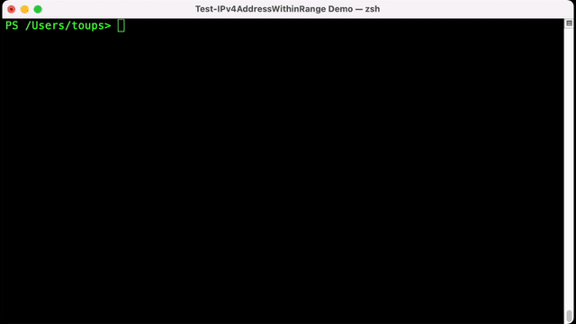
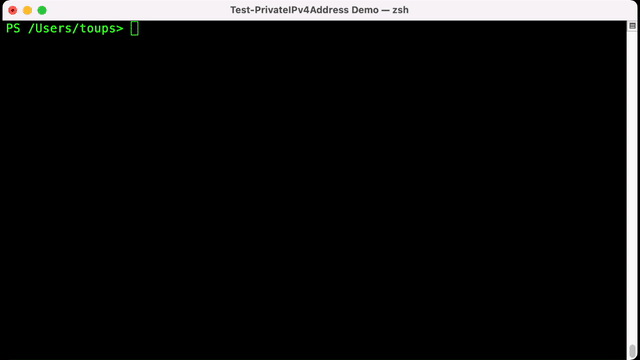

#  IPv4Toolbox PowerShell Module

   

## Description

Module to simplify the manipulation, discovery, and testing of IPv4 Addresses .

## How to deploy from the PowerShell Gallery

### [PowerShell Gallery Package Information](https://www.powershellgallery.com/packages/IPv4Toolbox)

### Install

```powershell
Install-Module -Name 'IPv4Toolbox' -Scope 'CurrentUser'
```

### Update

```powershell
Update-Module -Name 'IPv4Toolbox' -Scope 'CurrentUser'
```

### PowerShell Desired State Configuration

The PackageManagement module should be at least version 1.1.7.0 for the following property information to be correct.

```powershell
PackageManagementSource PSGallery {
    Ensure             = 'Present'
    Name               = 'PSGallery'
    ProviderName       = 'PowerShellGet'
    SourceLocation     = 'https://www.powershellgallery.com/api/v2'
    InstallationPolicy = 'Trusted'
}

PackageManagement IPv4Toolbox {
    Ensure             = 'Present'
    Name               = 'IPv4Toolbox'
    Source             = 'PSGallery'
    DependsOn          = '[PackageManagementSource]PSGallery'
}
```

## What's New

### 0.6.0

- Added [Test-IPv4Address](Docs/Test-IPv4Address.md) function
- Added [ConvertFrom-InverseAddress](Docs/ConvertFrom-InverseAddress.md) function
- [Invoke-IPv4GeoLookup](Docs/Invoke-IPv4GeoLookup.md) accepts input from the command line
- Migrating functions to use HTTPS APIs
- Increased verbosity of functions
- Cleaned up documentation
- Example animations

## Functions

### [ConvertFrom-InverseAddress](Docs/ConvertFrom-InverseAddress.md)

Converts an Inverse Address to either an IPv4 Address or Subnet in CIDR address format.



### [ConvertTo-InverseAddress](Docs/ConvertTo-InverseAddress.md)

Converts an IPv4 Address or Subnet into a Windows PTR Zone compatible domain name.



### [Find-IPv4Address](Docs/Find-IPv4Address.md)

Returns all valid IPv4 Addresses in a string.


### [Get-MyPublicIP](Docs/Get-MyPublicIP.md)

Returns the Public IPv4 Address of the client returned by a web API.


### [Get-SubnetInformation](Docs/Get-SubnetInformation.md)

Returns the information regarding a subnet that an IPv4 Address exists.


### [Invoke-IPv4GeoLookup](Docs/Invoke-IPv4GeoLookup.md)

Returns GeoIP Information for an IPv4 Address from [ip-api](https://ip-api.com).


### [Invoke-IPv4ListSort](Docs/Invoke-IPv4ListSort.md)

Sorts an array of IPv4 Addresses including CIDR address ranges.



### [Out-SubnetRange](Docs/Out-SubnetRange.md)

Outputs a list of IPv4 Addresses from a CIDR address range.



### [Split-Subnet](Docs/Split-Subnet.md)

Breaks up a larger CIDR into small CIDRs.



### [Test-IPv4Address](Docs/Test-IPv4Address.md)

Tests a string to determine if it is a valid IPv4 Address (0.0.0.0 to 255.255.255.255).



### [Test-IPv4AddressWithinRange](Docs/Test-IPv4AddressWithinRange.md)

Evaluates if an IPv4 Address is equal or within an IPv4 Address range.



### [Test-PrivateIPv4Address](Docs/Test-PrivateIPv4Address.md)

Determines if an IPv4 Address is in a private address space as defined by [RFC 1918](https://datatracker.ietf.org/doc/html/rfc1918) & [RFC 6598](https://datatracker.ietf.org/doc/html/rfc6598).



## License

IPv4Toolbox is provided under the [Apache license](LICENSE).

Authored by Robert M. Toups, Jr.
